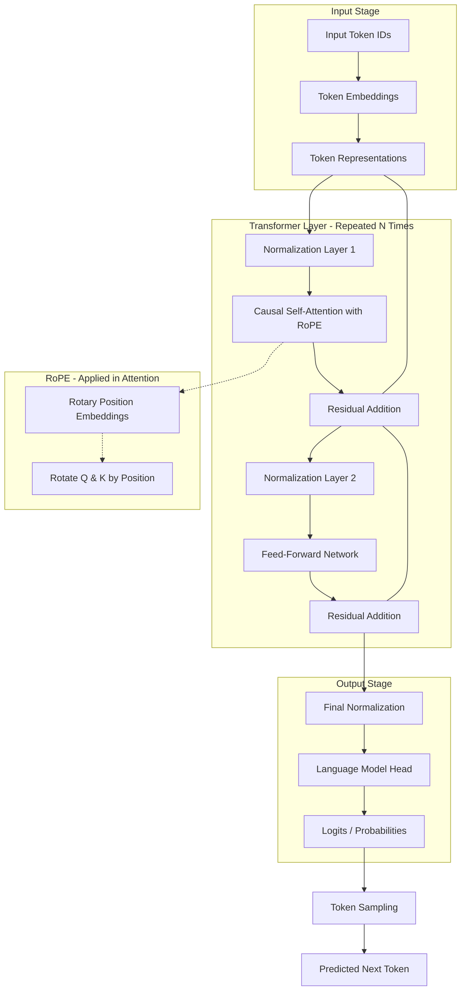

# MicroLLM

MicroLLM is a compact, Transformer-based Large Language Model (LLM) implementation. It is designed to be a "miniature" version of state-of-the-art models like GPT-2, making it an excellent resource for learning about LLM architecture, training, and inference.

Despite its "micro" name, it packs a full Transformer decoder stack with modern features like mixed-precision training and weight tying.

## Features

- **Modern Transformer Architecture:** Implements a 12-layer, 12-head Transformer decoder with state-of-the-art improvements.
- **Rotary Position Embeddings (RoPE):** Uses RoPE instead of learned position embeddings for better long-context performance and extrapolation, as seen in LLaMA and GPT-NeoX.
- **16K Context Window:** Supports up to 16,384 tokens in context (~12,000 words or ~50 pages of text).
- **Causal Self-Attention:** Multi-head attention mechanism with causal masking for generative tasks.
- **Pre-LN Configuration:** Uses Layer Normalization before sub-layers (Pre-Norm) for improved training stability in deep stacks.
- **Weight Tying:** Shares weights between Token Embeddings and the Language Model Head to reduce parameter count and regularize the model.
- **Mixed Precision Training:** Leverages `torch.amp` (Automatic Mixed Precision) for faster training and reduced VRAM usage on NVIDIA GPUs.
- **Streaming Data Pipeline:** Dynamically streams the `TinyStories` dataset from Hugging Face, enabling training even on machines with limited disk space.
- **Inference with Sampling:** Built-in sequential generator with temperature-based multinomial sampling for creative text generation.

## Architecture Diagram

The following diagram illustrates the data flow within MicroLLM:



## Architectural Overview

MicroLLM implements a **Decoder-only Transformer** architecture, which is the foundation for modern generative AI models. Each part of the system plays a critical role in how the model understands and generates language:

### 1. The Embedding Layer
The model doesn't understand "words" directly. We convert discrete tokens into high-dimensional vectors using **Token Embeddings**. Unlike traditional approaches that add learned position embeddings, MicroLLM uses **Rotary Position Embeddings (RoPE)** which encode position information directly in the attention mechanism through rotation matrices.

### 2. Rotary Position Embeddings (RoPE)
Instead of adding position vectors to embeddings, RoPE rotates the query and key vectors in the attention mechanism by an angle proportional to their position. This approach:
- **Saves Parameters:** No learned position embedding matrix needed
- **Better Extrapolation:** Can handle sequences longer than training length
- **Relative Positions:** Naturally encodes relative position information
- **Modern Standard:** Used in LLaMA, GPT-NeoX, PaLM, and other state-of-the-art models

### 3. The Transformer Block (The Engine)
This is where the heavy lifting happens. Each block consists of two main components:
- **Causal Self-Attention with RoPE:** This allows tokens to "talk" to each other with position awareness. Because it is "causal," a token can only look at previous tokens in the sequence. RoPE rotations are applied to queries and keys before computing attention weights.
- **Feed-Forward Network (MLP):** After the attention layer gathers context, the MLP processes this information independently for each token. It expands the data into a higher dimension (usually 4x) to allow for complex feature extraction and then compresses it back.

### 4. Normalization and Residual Connections
- **Layer Normalization:** Applied before each sub-layer to keep the internal signals stable, preventing them from becoming too large or too small as they pass through many layers.
- **Residual Connections:** We add the input of a layer back to its output. This allows the gradient to flow "around" the layers during training, making it possible to train very deep networks without losing information.

### 5. The Output Head
The final vector from the Transformer stack is projected back into a space as large as our vocabulary. These values (Logits) represent the model's "confidence" for what the next token should be. We use **Sampling** (like temperature-based sampling) to inject variety into the generation process.

## Getting Started

### Prerequisites

- Python 3.12+
- CUDA-enabled GPU (recommended for training, though defaults to CPU)

### Installation

1. Clone the repository:
   ```bash
   git clone https://github.com/your-username/MicroLLM.git
   cd MicroLLM
   ```

2. Install dependencies (create venv):
   ```bash
   uv sync
   ```

### Training

The training and inference logic is located in `main.py`. To start training the model on the `TinyStories` dataset, run the script directly:

```bash
python main.py
```

Or import the `train` function in your own script:

```python
from main import train

# This will initialize training and save weights to 'model_weights.pth'
trained_model, tokenizer = train()
```

The training process includes automatic checkpointing every 50 steps.

### Inference

To generate text, you can use the `generate` function from `main.py`:

```python
from main import generate

prompt = "Once there was a little robot who"
output = generate(trained_model, tokenizer, prompt, max_len=150)
print(output)
```

## Technical Details: RoPE Implementation

### How RoPE Works

Rotary Position Embeddings encode position information by rotating query and key vectors in the attention mechanism:

1. **Frequency Computation:** For each dimension pair, compute rotation frequencies based on position
2. **Rotation Matrices:** Apply 2D rotation matrices to consecutive dimension pairs
3. **Position Encoding:** Each position gets a unique rotation angle, creating relative position awareness

### Benefits Over Learned Embeddings

| Aspect | Learned Position Embeddings | RoPE |
|--------|----------------------------|------|
| **Parameters** | Requires vocab_size × embedding_dim weights | Zero additional parameters |
| **Context Extension** | Fixed to training length | Can extrapolate beyond training length |
| **Position Type** | Absolute positions | Relative positions (better for attention) |
| **Memory** | Stores embedding matrix | Only stores precomputed cos/sin cache |

### Context Window Flexibility

With RoPE, you can:
- **Train** on shorter sequences (e.g., 4K tokens) for efficiency
- **Inference** on longer sequences (e.g., 16K tokens) with graceful degradation
- **Extend** the cache dynamically as needed

## Configuration

The model's dimensions can be customized in `core/micro_llm.py` via the `ModelConfig` dataclass:

| Parameter | Default Value | Description |
| :--- | :--- | :--- |
| `block_size` | 16384 | Maximum sequence length (16K tokens) |
| `vocab_size` | 50257 | Vocabulary size (GPT-2 tokenizer) |
| `n_layer` | 12 | Number of Transformer blocks |
| `n_head` | 12 | Number of attention heads |
| `n_embd` | 768 | Embedding dimension |
| `dropout` | 0.1 | Dropout regularization rate |
| `bias` | False | Use bias in linear layers |

---
