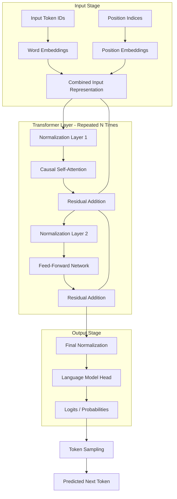

# MicroLLM 

MicroLLM is a compact, Transformer-based Large Language Model (LLM) implementation. It is designed to be a "miniature" version of state-of-the-art models like GPT-2, making it an excellent resource for learning about LLM architecture, training, and inference.

Despite its "micro" name, it packs a full Transformer decoder stack with modern features like mixed-precision training and weight tying.

## 🌟 Features

- **Standard GPT-2 Architecture:** Implements the classic 12-layer, 12-head Transformer architecture.
- **Causal Self-Attention:** Multi-head attention mechanism with causal masking for generative tasks.
- **Pre-LN Configuration:** Uses Layer Normalization before sub-layers (Pre-Norm) for improved training stability in deep stacks.
- **Weight Tying:** Shares weights between Token Embeddings and the Language Model Head to reduce parameter count and regularize the model.
- **Mixed Precision Training:** Leverages `torch.amp` (Automatic Mixed Precision) for faster training and reduced VRAM usage on NVIDIA GPUs.
- **Streaming Data Pipeline:** Dynamically streams the `TinyStories` dataset from Hugging Face, enabling training even on machines with limited disk space.
- **Inference with Sampling:** Built-in sequential generator with temperature-based multinomial sampling for creative text generation.

## 🏗️ Architecture Diagram

The following diagram illustrates the data flow within MicroLLM:



## 🧠 Architectural Overview

MicroLLM implements a **Decoder-only Transformer** architecture, which is the foundation for modern generative AI models. Each part of the system plays a critical role in how the model understands and generates language:

### 1. The Embedding Layer
The model doesn't understand "words" directly. We convert discrete tokens into high-dimensional vectors. To ensure the model knows the order of words, we add **Position Embeddings** to the **Word Embeddings**. This combined vector provides the initial "meaning" and "location" of each token in the sequence.

### 2. The Transformer Block (The Engine)
This is where the heavy lifting happens. Each block consists of two main components:
- **Causal Self-Attention:** This allows tokens to "talk" to each other. Because it is "causal," a token can only look at previous tokens in the sequence. It calculates a weight for every previous token to determine which ones are most relevant to the current context.
- **Feed-Forward Network (MLP):** After the attention layer gathers context, the MLP processes this information independently for each token. It expands the data into a higher dimension (usually 4x) to allow for complex feature extraction and then compresses it back.

### 3. Normalization and Residual Connections
- **Layer Normalization:** Applied before each sub-layer to keep the internal signals stable, preventing them from becoming too large or too small as they pass through many layers.
- **Residual Connections:** We add the input of a layer back to its output. This allows the gradient to flow "around" the layers during training, making it possible to train very deep networks without losing information.

### 4. The Output Head
The final vector from the Transformer stack is projected back into a space as large as our vocabulary. These values (Logits) represent the model's "confidence" for what the next token should be. We use **Sampling** (like temperature-based sampling) to inject variety into the generation process.

## 🚀 Getting Started

### Prerequisites

- Python 3.12+
- CUDA-enabled GPU (recommended for training, though defaults to CPU)

### Installation

1. Clone the repository:
   ```bash
   git clone https://github.com/your-username/MicroLLM.git
   cd MicroLLM
   ```

2. Install dependencies (using `uv` or `pip`):
   ```bash
   pip install torch torchvision tiktoken datasets tqdm aiohttp
   ```

### Training

To start training the model on the `TinyStories` dataset, run `main.py` directly or import the `train` function:

```python
from main import train

# This will initialize training and save weights to 'model_weights.pth'
trained_model, tokenizer = train()
```

The training process includes automatic checkpointing every 50 steps.

### Inference

Generate text based on a prompt:

```python
from main import generate

prompt = "Once there was a little robot who"
output = generate(trained_model, tokenizer, prompt, max_len=150)
print(output)
```

## ⚙️ Configuration

The model's dimensions can be customized in `core/micro_llm.py` via the `ModelConfig` dataclass:

| Parameter | Default Value | Description |
| :--- | :--- | :--- |
| `block_size` | 512 | Maximum sequence length |
| `vocab_size` | 50257 | vocabulary size |
| `n_layer` | 12 | Number of Transformer blocks |
| `n_head` | 12 | Number of attention heads |
| `n_embd` | 768 | Embedding dimension |
| `dropout` | 0.1 | Dropout regularization rate |

---
